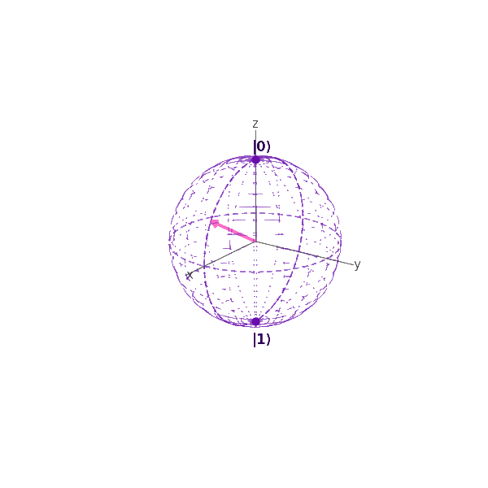
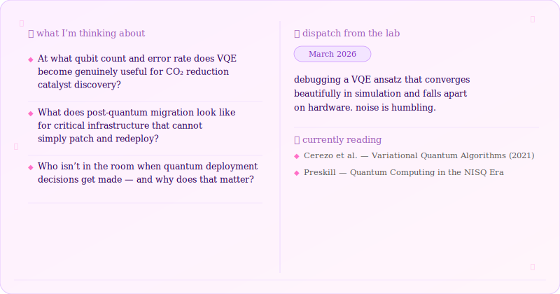

# ⊹ ˚｡🍋° ᡣ𐭩₊ Hi, I'm Jacinta ⊹୧ ‧₊˚ 🍓 ⋅☆
I work at the intersection of quantum hardware and deployment; from nanofabrication in the lab to the systems questions that determine whether quantum technologies create infrastructure or remain experiments.  My current focus is the real-world implications of frontier quantum tech: post-quantum cryptography migration, quantum simulation for climate-relevant materials, and the gap between NISQ-era results and the fault-tolerant assumptions present in most roadmaps.  I care deeply about who gets to build this field and what footprint it will leave on this beautiful planet of ours. 

## ‧₊𖥧🦋 Socials ‧₊⚘❀༉˚.
 

  

# 🍎༻˚₊♡ Tech Stack 🧠📚 ༘⋆₊

          

## ‧₊˚✦ Currently

  ## 🫖 ༘₊˚🍵 Buy me a matcha 🍑ིྀ⋅ᰔ°🍡°⋆ ࿔*:
  

